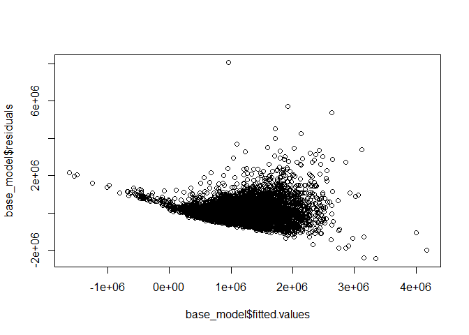

melbourne\_house\_price\_prediction
================
Kevin
29 May 2021

``` r
library(tidyverse)
```

    ## -- Attaching packages --------------------------------------- tidyverse 1.3.1 --

    ## v ggplot2 3.3.3     v purrr   0.3.4
    ## v tibble  3.1.1     v dplyr   1.0.6
    ## v tidyr   1.1.3     v stringr 1.4.0
    ## v readr   1.4.0     v forcats 0.5.1

    ## -- Conflicts ------------------------------------------ tidyverse_conflicts() --
    ## x dplyr::filter() masks stats::filter()
    ## x dplyr::lag()    masks stats::lag()

``` r
library(data.table)
```

    ## 
    ## Attaching package: 'data.table'

    ## The following objects are masked from 'package:dplyr':
    ## 
    ##     between, first, last

    ## The following object is masked from 'package:purrr':
    ## 
    ##     transpose

``` r
house_raw <- fread('data/melb_data.csv', colClasses = c('Suburb' = 'factor', 'Type' = 'factor', 'CouncilArea' = 'factor',
                                                        'Method' = 'factor', 'Regionname' = 'factor', 'Postcode'='factor'))
summary(house_raw)
```

    ##             Suburb        Address              Rooms        Type    
    ##  Reservoir     :  359   Length:13580       Min.   : 1.000   h:9449  
    ##  Richmond      :  260   Class :character   1st Qu.: 2.000   t:1114  
    ##  Bentleigh East:  249   Mode  :character   Median : 3.000   u:3017  
    ##  Preston       :  239                      Mean   : 2.938           
    ##  Brunswick     :  222                      3rd Qu.: 3.000           
    ##  Essendon      :  220                      Max.   :10.000           
    ##  (Other)       :12031                                               
    ##      Price         Method      SellerG              Date          
    ##  Min.   :  85000   PI:1564   Length:13580       Length:13580      
    ##  1st Qu.: 650000   S :9022   Class :character   Class :character  
    ##  Median : 903000   SA:  92   Mode  :character   Mode  :character  
    ##  Mean   :1075684   SP:1703                                        
    ##  3rd Qu.:1330000   VB:1199                                        
    ##  Max.   :9000000                                                  
    ##                                                                   
    ##     Distance        Postcode        Bedroom2         Bathroom    
    ##  Min.   : 0.00   3073.0 :  359   Min.   : 0.000   Min.   :0.000  
    ##  1st Qu.: 6.10   3020.0 :  306   1st Qu.: 2.000   1st Qu.:1.000  
    ##  Median : 9.20   3121.0 :  292   Median : 3.000   Median :1.000  
    ##  Mean   :10.14   3040.0 :  290   Mean   : 2.915   Mean   :1.534  
    ##  3rd Qu.:13.00   3046.0 :  284   3rd Qu.: 3.000   3rd Qu.:2.000  
    ##  Max.   :48.10   3165.0 :  249   Max.   :20.000   Max.   :8.000  
    ##                  (Other):11800                                   
    ##       Car           Landsize         BuildingArea     YearBuilt   
    ##  Min.   : 0.00   Min.   :     0.0   Min.   :    0   Min.   :1196  
    ##  1st Qu.: 1.00   1st Qu.:   177.0   1st Qu.:   93   1st Qu.:1940  
    ##  Median : 2.00   Median :   440.0   Median :  126   Median :1970  
    ##  Mean   : 1.61   Mean   :   558.4   Mean   :  152   Mean   :1965  
    ##  3rd Qu.: 2.00   3rd Qu.:   651.0   3rd Qu.:  174   3rd Qu.:1999  
    ##  Max.   :10.00   Max.   :433014.0   Max.   :44515   Max.   :2018  
    ##  NA's   :62                         NA's   :6450    NA's   :5375  
    ##         CouncilArea     Lattitude        Longtitude   
    ##               :1369   Min.   :-38.18   Min.   :144.4  
    ##  Moreland     :1163   1st Qu.:-37.86   1st Qu.:144.9  
    ##  Boroondara   :1160   Median :-37.80   Median :145.0  
    ##  Moonee Valley: 997   Mean   :-37.81   Mean   :145.0  
    ##  Darebin      : 934   3rd Qu.:-37.76   3rd Qu.:145.1  
    ##  Glen Eira    : 848   Max.   :-37.41   Max.   :145.5  
    ##  (Other)      :7109                                   
    ##                       Regionname   Propertycount  
    ##  Southern Metropolitan     :4695   Min.   :  249  
    ##  Northern Metropolitan     :3890   1st Qu.: 4380  
    ##  Western Metropolitan      :2948   Median : 6555  
    ##  Eastern Metropolitan      :1471   Mean   : 7454  
    ##  South-Eastern Metropolitan: 450   3rd Qu.:10331  
    ##  Eastern Victoria          :  53   Max.   :21650  
    ##  (Other)                   :  73

## Missing Data Imputation(Mean)

``` r
house_raw <- house_raw %>% mutate_at(vars(Car),~ifelse(is.na(.x), mean(.x, na.rm = TRUE), .x))
```

``` r
set.seed(101) 
sample <- sample.int(n = nrow(house_raw), size = floor(.8*nrow(house_raw)), replace = F)
train <- house_raw[sample, ]
test  <- house_raw[-sample, ]
```

## Baseline - Only numeric features(Rooms, Distance, Bedroom2, Bathroom, Car, Landsize, Lattitude, Longitude, Propertycount)

(Ignoring BuildingArea and YearBuilt)

``` r
RMSE <- function(error) { sqrt(mean(error^2)) }
base_model <- lm(Price ~ Rooms + Distance + Bedroom2 + Bathroom + Car + Landsize +
              Lattitude + Longtitude + Propertycount, data=train)
summary(base_model)
```

    ## 
    ## Call:
    ## lm(formula = Price ~ Rooms + Distance + Bedroom2 + Bathroom + 
    ##     Car + Landsize + Lattitude + Longtitude + Propertycount, 
    ##     data = train)
    ## 
    ## Residuals:
    ##      Min       1Q   Median       3Q      Max 
    ## -2442759  -275568   -68319   179306  8045151 
    ## 
    ## Coefficients:
    ##                 Estimate Std. Error t value Pr(>|t|)    
    ## (Intercept)   -2.020e+08  6.554e+06 -30.825  < 2e-16 ***
    ## Rooms          2.318e+05  1.630e+04  14.221  < 2e-16 ***
    ## Distance      -4.478e+04  8.415e+02 -53.216  < 2e-16 ***
    ## Bedroom2       7.865e+04  1.635e+04   4.810 1.53e-06 ***
    ## Bathroom       1.740e+05  8.260e+03  21.068  < 2e-16 ***
    ## Car            5.953e+04  5.289e+03  11.255  < 2e-16 ***
    ## Landsize       1.666e+01  2.883e+00   5.778 7.77e-09 ***
    ## Lattitude     -1.703e+06  6.123e+04 -27.823  < 2e-16 ***
    ## Longtitude     9.511e+05  4.801e+04  19.809  < 2e-16 ***
    ## Propertycount -2.513e+00  1.030e+00  -2.439   0.0147 *  
    ## ---
    ## Signif. codes:  0 '***' 0.001 '**' 0.01 '*' 0.05 '.' 0.1 ' ' 1
    ## 
    ## Residual standard error: 468500 on 10854 degrees of freedom
    ## Multiple R-squared:  0.4807, Adjusted R-squared:  0.4803 
    ## F-statistic:  1116 on 9 and 10854 DF,  p-value: < 2.2e-16

``` r
RMSE(base_model$residuals)
```

    ## [1] 468309.9

``` r
plot(x=base_model$fitted.values, y=base_model$residuals)
```

<!-- -->
